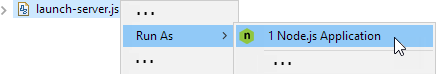

= JSDT demo 01
Patrik Suzzi <psuzzi@gmail.com>
Version 1.0, 23.10.2016
:keywords: JSDT, demo, nodejs, bower, npm, javascript, eclipse 
:experimental:

*Angular.JS* single page application with _routes_ and _controller_.
Styling is done via *Bootstrap* and *FontAwesome*. The demo also has a *Node.js* _script_ to launch a local *Express* _server_ to serve the application. 

Prerequisites:: You installed latest Eclipse JSDT or JEE. As JSDT integrates Node.js (and its tools) on your system, you should also have installed Node.js, npm and Bower.

To verify the prerequisites, presse kbd:[Ctrl+Alt+T] to open the command prompt in Eclipse, and type `node -v`, `npm -v` and `bower -v`,  to verify the tools are installed. 
 

== Run the application

* install bower dependencies: r-click on  `bower.json` then select *Run As.. > Bower Install*. This will install the needed dependencies under the `bower_components` folder 

Now you can open _index.html_ in your browser.  

Actually, you'll see the application will work on Firefox but not on Chrome

== Cross-origins requests

Angular routing is not working on local files. Hence, you'll see an empty page when launching the page in Chrome. You can detect the error only by inspecting the page. 

To fix this, we'll use nodejs to launch a lightweight local server to serve static content.

[source, javascript]
----
include::launch-server.js[lines=8..20]
----

To run the script, we need to install the needed libraries, and to run the script with nodejs

install dependencies:: R-click `package.json` and select *Run As.. > NPM Install*. This will install the needed dependencies under the `node_modules` folder

run node script:: R-click 'launch-static-server.js' and select *Run As .. > Node.js Application*. This will launch node passing your script as parameter

The script launches the server, and loads the content of the current directory, which displays our _index.html_, where you can see the content is loaded usign angular routing. 

image::assets/angular-single-page-app.png[]

To stop the server, you can just terminate the process in Eclipse.

'''

=== Copyright & License

CopyRight (C) Patrik Suzzi, 2016. You can use the software examples free of charge, under the terms of https://www.eclipse.org/legal/epl-v10.html[EPL] license.

