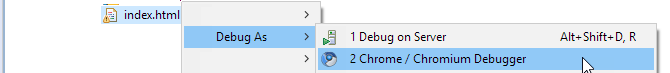
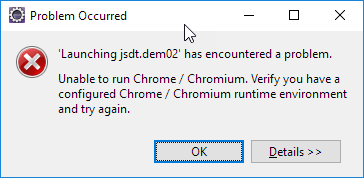
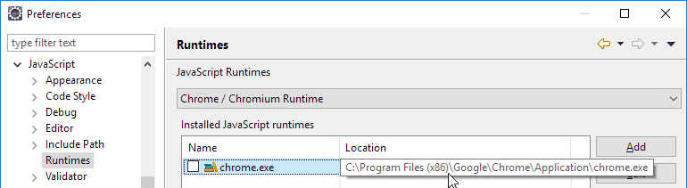
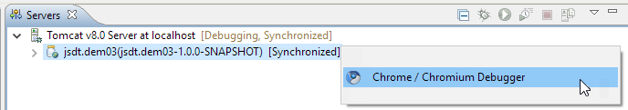
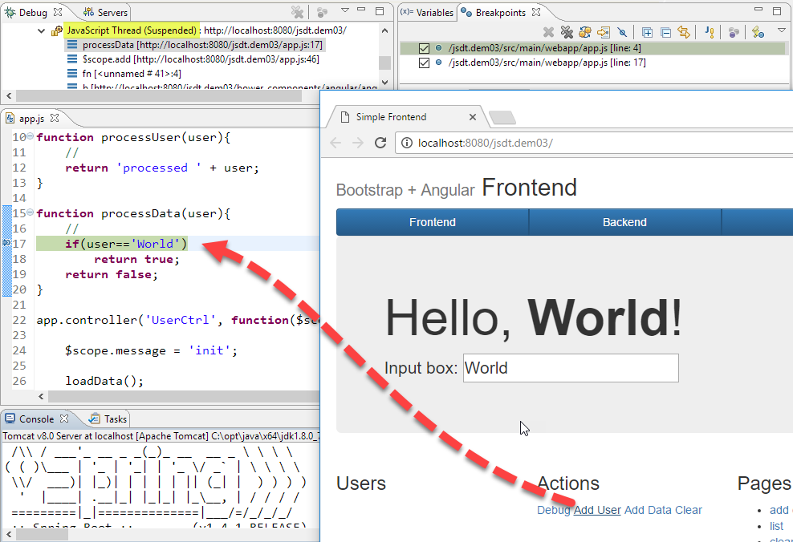

= JSDT demo 03
Patrik Suzzi <psuzzi@gmail.com>
Version 1.0, 23.10.2016
:keywords: JSDT, demo, javascript, eclipse, spring, nodejs, bower, npm, 
:experimental:

*SpringBoot* backend with a controller that sends json data on `/dev`, to simulate a JSON API. The Angular frontend gets data from the backend. 

With this demo we see how to debug a JavaScript frontend and the relates Java backend. 

== Debug the Application Frontend
 
If you work on a simple html + js web page, you can debug it inside eclipse using the chrome/chromium debugger

If that is not working out of the box, Eclipse wasn't able to locate your chrome/chromium instance to use for debug.
 

 
To solve this issue, open menu: *Window > Preferences*, go to the *Javascript > Runtinmes* page, 
then add the location for your chrome  executable; in this case  `C:\Program Files (x86)\Google\Chrome\Application\chrome.exe`.
 

 
 
== Java Web App

You can use the Chrome/Chromium debugger also on server applications, 
if your have a maven web application in which JavaScript files are located in the webapp folder. 

This demo has a Java/Web SpringBoot backend with an Angular frontend,
and is a maven project with a webapp folder containing javascript and all frontend contents. 

So, launche your webapp in debug mode on your server, tomcat in my case. 
Then, in the servers view, select the application an select "Chrome/Chromium debugger". 

 

here we go, so you can put breakpoints to debug JavaScript

And at the same time you can also debug your Java-Web Application

image::assets/java-and-javascript-debug.png[]

